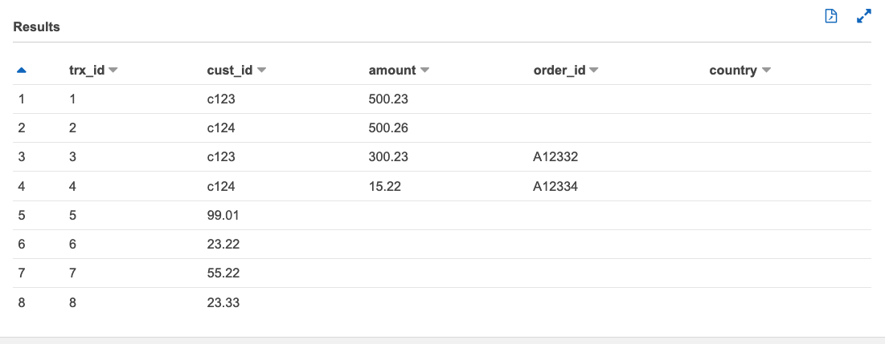

# Project


## The Problem - CSVs with different schemas

Imagine we have four CSV files that contain rows from the same logical table, and some of the files contain columns not found in the others:

* **s3://bucket/raw/csv/transactions/trx1.csv**:

    ```
    |trx_id|cust_id|amount|
    |------|-------|------|
    |001   |c123   |500.23|
    |002   |c124   |500.26|
    ```

* **s3://bucket/raw/transactions/trx2.csv**:

    ```
    |trx_id|cust_id|amount|order_id|
    |------|-------|------|--------|
    |003   |c123   |300.23|A12332  |
    |004   |c124   |15.22 |A12334  |
    ```

* **s3://bucket/raw/csv/transactions/trx3.csv**

    ```
    |trx_id|amount|
    |------|------|
    |005   |99.01 |
    |006   |23.22 |
    ```

* **s3://bucket/raw/csv/transactions/trx4.csv**

    ```
    |trx_id|amount|country|
    |------|------|-------|
    |007   |55.22 |USA    |
    |008   |23.33 |CA     |
    ```

Now, say we define and run an AWS Glue Crawler over our CSV files in the S3 path `s3://bucket/raw/transactions/*`. The crawler will inspect the files and do its best to identify the columns present. However, even if the crawler correctly identifies all columns and data types, a Hive catalog's table can only have *one* schema definition. Since CSV schema definitions require that column order be defined, this means that if our source CSV files have columns in different order, then our schema will never be able to accurately represent all columns for all files.

Let's look at an example. In aggregate, our four files have five columns: `trx_id`, `cust_id`, `amount`, `order_id`, and `country`.

We've run our crawler on the four sample files above, and it has identified all five columns: 


However, the problem is that the order above is the order that any Hive-compatible query engine (e.g. Spark, Presto, etc.) would expect the columns to be in the source files. This order matches our first two files (missing columns are ok as long as they are at the end of each row), but it does not match the order of columns in `trx3.csv` and `trx4.csv`. 

Let's look at the impact of this problem by querying our table with Amazon Athena:


Below, you can see that the query "succeeds", but certain values are either missing or appear in the wrong column because some of the files orders don't match the Hive schema definition. 




## Solutions

I can think of two broad approaches to solve this problem, but of course there may be other/better ideas out there. 

### Solution 1 - Separate logical tables per schema

Solution 1 would require that you first partition your S3 objects into a separate path and logical table for each different schema. From there, you would use the tool of your choice (e.g. Glue Spark jobs or Athena SQL) to query and join each table together. 

For example, imagine your transaction CSV files have, in aggregate, three different schemas. Your S3 structure would look like this: 

* `s3://bucket/raw/csv/transactions/v1/*` -> maps to Glue catalog table `transactions_v1`
* `s3://bucket/raw/csv/transactions/v1/*` -> maps to Glue catalog table `transactions_v2`
* `s3://bucket/raw/csv/transactions/v1/*` -> maps to Glue catalog table `transactions_v3`

Using SQL as an example, we would then `UNION` the tables together. Of course, we would have to do some data cleansing/manipulation to handle the fact that the schemas don't match. For example, if one table was missing `cust_id`, we would use a `SELECT null as cust_id, ...` for that table; if two tables had the same column name but different formats, we would have to typecast them all to the same type, as well.

### Solution 2 - Convert CSV to a column-oriented data structure like Parquet

CSVs are simple "row-oriented" formats where row order must match. In contrast, certain columnnar-storage formats like Apache Parquet store data in column-based chunks, and column order does not matter. 

In other words, if we convert our CSV files into Parquet files, we should be able to successfully query the group of Parquet files as a single logical table, even if individual files have columns that others do not. Note - when two Parquet files share the same columns, they *do* still need to be the same data type. 

To demonstrate this, we've written a simple python script, `convert_to_parquet.py`, that converts each of our CSV files to its own Parquet file. Our CDK deployment script then uploads all four Parquet files to `s3://bucket/raw/parquet/transactions/`. 

Again, we run a Glue Crawler on our Parquet files and the same five columns are detected. The key difference, however, is that the Glue crawler has detected that our files are Parquet and we no longer have to worry about column order (the concept of 'column order' does not exist in a Parquet file).


This time, if we use Athena to query our Parquet S3 table with the same query as before (`select * from transactions`), we can see that all data is correctly identified: 


## Closing thoughts

If you're like me, I feel like option #2 is a bit cleaner, not to mention that Parquet format provides greater compression and query performance. The question becomes, how do you "productionize" this workflow? 

Very high-level, I might try something like this: 

1. Source CSV files are uploaded as ojects to `s3://bucket/raw/csv/tableXYZ/*`

2. Upon S3 object creation, an [S3 Event notification](https://docs.aws.amazon.com/AmazonS3/latest/userguide/NotificationHowTo.html) adds the object name / info to an SQS queue

3. A Lambda function is invoked for each item in the SQS queue. If the files are small enough to fit within Lambda's memory/CPU and 15-minute timeout constraints, the Lambda function itself converts the object to Parquet. If the files are very large, then Lambda may instead invoke a separate process (such as an AWS Glue Spark job) to convert the files to Parquet. Regardless, the parquet files are written to a new S3 path, such as `s3://bucket/raw/parquet/tableXYZ/*`

4. Just as with the CSV files, an S3 Event Notification can be used to trigger a Glue Crawler (via Lambda) to crawl newly-created Parquet files and update our Glue Catalog. 

5. Once the Glue catalog is updated, the parquet table is immediately available for querying by supported AWS services (e.g. Athena, EMR, Redshift Spectrum) as well as additional ETL/processing by AWS Glue jobs (Spark or Python shell scripts). 

Again, its important to call out that the approach above assumes when two CSV files contain the same column names, they are the same data format. If they are different formats, unexpected results may occur. You would need to account for this by explicitly typecasting to proper formats in Step 3, above.